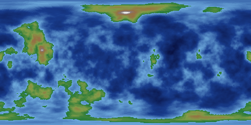
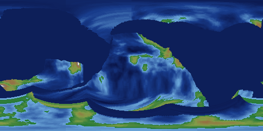
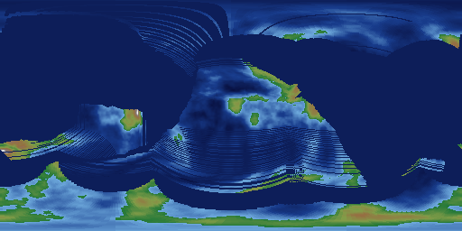

# Phase 1 spike findings — plate seeding (#9) & crust advection shootout (#10)

Prototype code: `packages/sim-cli/spikes/` (`plate-seeding.ts`,
`advection-shootout.ts`, shared `lib.ts`). Both use the kernel's real
`grid.ts`/`rng.ts`/`hash.ts` — no parallel grid math. Reproduce with:

```
pnpm -F sim-cli exec tsx spikes/plate-seeding.ts
pnpm -F sim-cli exec tsx spikes/advection-shootout.ts
```

---

## Spike #9 — plate seeding & Voronoi flood-fill partition

**Method.** Sites drawn from `rng.fork('plates')` with rejection sampling for
minimum angular separation `0.7·√(4π/numPlates)` (deterministically relaxed
by ×0.85 after 64 failed draws, so termination is guaranteed). All plates
grown simultaneously by Dijkstra over the 4-neighbor graph with per-cell edge
cost `1 + jitter · hash01(cell)` — a deterministic warped-metric Voronoi.
Priority ties broken (cost, cell, plate), so the partition is a pure function
of (seed, numPlates, jitter).

**Results** (N=128, seeds {1, 42, 1337} × plates {6, 8, 12, 20} × jitter
{0, 1.5, 3} — 36 runs): every partition contiguous, full coverage, zero
single-cell enclaves, byte-identical across reruns. Plate sizes vary ~2–3×
within a run (e.g. 12 plates: 5.5–13.9% of the sphere), which reads as
natural. Boundaries cross cube-face seams and corners with no visible
artifacts. Jitter 0 is too clean (straight Voronoi edges), 3 is noisy;
**1.5 is the keeper**.


**Recommendation.** Seeding recipe as above with `jitter = 1.5`;
**default `numPlates = 10`** (8 reads slightly sparse, 12 slightly busy;
10 splits the difference — a params knob either way, and Wilson cycles will
move the live count within bounds anyway).

---

## Spike #10 — crust advection candidate shootout

**Common machinery.** 3 plates (seed-42 partition), known Euler poles at
2.4–6.4e-3 rad/Myr (≈1.5–4 cm/yr), dt = 1 Myr, 500 steps, N=128.
Sub-cell accumulation for both candidates: per-plate accumulated angle θ_p;
a plate advects only when |θ_p| ≥ θ_min = (π/2)/N (one cell's angular width),
and then by the **full accumulated angle** (no remainder is discarded), then
resets. Slow plates simply trip less often — no stalls, no lost motion.
Overlap precedence (spike-only stand-in for #16's subduction rules): moving
beats static, then lower plate id, then lower source index. Gaps repaired by
deterministic majority-of-assigned-neighbors passes, filled as young-ocean
marker crust (−2500 m).

**Metrics after 500 steps:**

| Metric | A: gather | B: scatter+repair |
|---|---|---|
| Deterministic rerun (hash) | yes | yes |
| ms/step at N=128 | 9.5 | 5.1 |
| Boundary cells 0 → 500 Myr | 1524 → 1563 (+2.6%) | 1524 → 1567 (+2.8%) |
| Single-cell enclaves | 0 | 0 |
| Gap cells repaired /step | 131 | 220 |
| Transport fidelity RMS/σ vs analytic | 1.45 | 1.48 |
| Interior artifacts | **none** | **striping (fatal)** |

**The decisive difference is qualitative.** In the gather scheme an interior
cell's backward-rotated source is always interior to the same plate, so
interiors are exact by construction; repairs happen only at real divergent
boundaries. In the scatter scheme, rigid rotation on the tangent-warped grid
is not cell-bijective: cells claimed twice / not at all appear **inside rigid
plate interiors** (~90 extra repairs/step), and each repair stamps young-ocean
elevation into a continent. Over 500 steps this reads as banded arc striping
across every plate:

| initial | gather, 500 Myr | scatter, 500 Myr |
|---|---|---|
|  |  |  |

Gather's dark swept regions are trailing-edge divergent gaps — exactly the
cells #15 turns into ridge-and-age bathymetry. Plate ownership stays rigid
and crisp over the full run:


**On the fidelity number.** RMS ≈ 1.45σ vs the analytic rigid rotation looks
alarming but is positional, not structural: each advection event resamples
nearest-neighbor, so feature positions random-walk ~0.5 cell per event
(√K growth, ≈8 cells over 500 events) while shapes stay coherent — the
flipbook shows continents visibly drifting as units. Values are copied, never
interpolated, so categorical fields (plateId, and later crustType) cannot
smear. We evaluated eliminating even this via per-plate reference rasters
(gather always from the plate-creation snapshot by total rotation — exactly
one resample ever): rejected, because Phase 1 adds per-step field writers
(erosion, subsidence, orogeny) whose write-backs into the reference raster
re-introduce per-event resampling anyway, at the cost of P extra rasters and
much harder rift/suture bookkeeping. If post-integration flipbooks show
unacceptable feature wander, revisit with periodic re-baselining (snapshot
every K events, √(events/K) wander).

**Failure modes of the loser.** Scatter+repair: interior hole striping (above)
— structural, not tunable; also 1.7× more repair work per step. Its only win
is raw speed (no per-moving-plate claim scan), which does not matter at
kernel scale (9.5 ms/step full-grid at N=128; golden tests take 10 steps).

## Recommendation (drives #13)

**Semi-Lagrangian gather** with per-plate quantized rotation accumulation
(θ_min = one cell width, apply-full-then-reset), majority-neighbor divergent
gap repair, and overlap resolution left to #16's density rules. Costs ~10
ms/step at N=128 today with obvious headroom (restrict claim tests to a
boundary band if the acceptance run needs it); at test-suite grid sizes it is
negligible.
